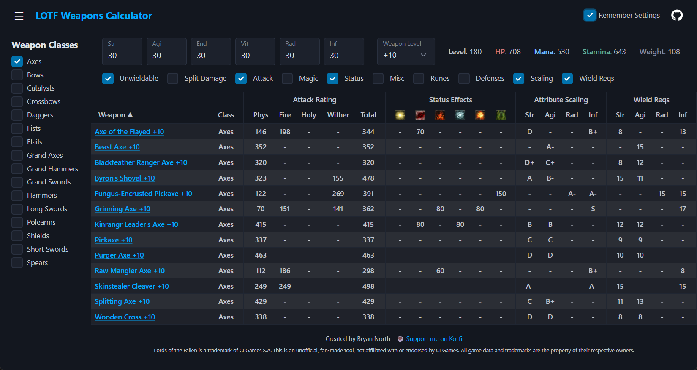

# LOTFCalc

LOTFCalc allows all weapons from Lords of the Fallen (2023 version) to be compared by calculating each weapon's individual stats for any combination of player attributes and upgrade level. All weapon data is current as of game version 2.5. You can use it at [https://slushie7.github.io/LOTFCalc/](https://slushie7.github.io/LOTFCalc/)



## Usage
Select the weapon classes you would like to see, enter your attributes, and set the desired weapon upgrade level. The calculator will show the calculated stats for all weapons in those classes. You can use the toggles above the weapons table to show and hide different types of information. Depending on your weapon class selection, LOTFCalc will automatically show and hide some columns to make it easier for you to see what you want to see (for example, if you only select melee weapons, the 'Magic' column group will be hidden; if you add 'Catalysts' to your select, the 'Magic' column group will be added).

LOTFCalc will automatically remember your most recently used settings and reload them the next time you visit the page. **To disable this feature, simple simply uncheck the "Remember Settings" button in the top-right corner of the page.**

### Options
LOTFCalc comes with a significant number of options that can be used to control the information you see. Because enabling them all at once creates an excessively large table, half of them are disabled by default. The options are:
- **Unwieldable** - If checked, weapons you lack the attributes to wield will still be shown. Uncheck to hide these weapons.
- **Split Damage** - In the game, attack ratings are shown as an addition of the weapon's base damage and the contribution from your stats. Check this to mimic this style.
- **Attack** - Show each weapon's attack rating in each of the game's four damage types.
- **Magic** - Show the spellpower and number of spell slots for each weapon. Only applies to catalysts.
- **Status** - Show the amount of status effect buildup each weapon applies.
- **Misc** - Show additional weapon stats used by the game - weight, poise damage, stagger damage, stamina damage multiplier, and PVP multiplier.
- **Runes** - Show the rune sockets available on each weapon at its current upgrade level. S=Strength, A=Agility, R=Radiance, I=Inferno, *=Meta (any rune).
- **Defenses** - Show each weapon's defense values and stability rating.
- **Scaling** - Show each weapon's scaling grade in each of the four damage attributes.
- **Reqs** - Show the attribute requirements for each weapon.

## Running Locally
LOTFCalc is easy to get running locally using Python as a server. Simply clone the repository, use a terminal to navigate the directory's root (where index.html is located), and run:
```
python -m http.server
```
You can then use a web browser to navigate to the localhost address provided by Python and use LOTFCalc.

## Updating Weapons Data
The calculator's weapon data all resides in a file, **weapons.json**, located in the **data** folder.

LOTFCalc's weapon data is current as of game version 2.5. As this was supposedly the final major update, it is unlikely that LOTFCalc's data will need to be updated. Regardless, the Python script used to prepare the data for LOTFCalc has been provided in the **LOTFCalcExtractor** directory.

### LOTFCalcExtractor
Before using the Python script, you must export all of the required JSON files from LOTF's game files by using FModel. How to do the extraction is beyond the scope of this readme. I highly recommend following the **excellent** [https://www.nexusmods.com/lordsofthefallen2023/mods/90?tab=description](guide made by Trevoorhees on Nexus Mods).

The following files must be exported using FModel's "Save Properties (.json)" feature:
- LOTF2/Content/Blueprints/Combat/AttackDefinitions/DT_UI_StatScalarDefinition.json
- LOTF2/Content/Blueprints/Data/Equipment/Weapons/Player/** (everything inside it)
- LOTF2/Content/Blueprints/Data/Stats/DT_CurveLibrary.json
- LOTF2/Content/Blueprints/Data/Stats/DT_RangedWeaponStats.json
- LOTF2/Content/Blueprints/Data/Stats/DT_ScalingCurveLibrary.json
- LOTF2/Content/Blueprints/Data/Stats/DT_WeaponStats.json
- LOTF2/Content/Localization/Game/en/Game.json
Once everything has been exported, you can run the LOTFCalcExtractor script by opening a terminal in its folder and running it:
```
python -m LOTFCalcExtractor "C:\\Users\\slushie7\\Downloads\\FModel\\Output\\Exports\\LOTF2"
```
*Replace the path with the path to the main "LOTF2" directory exported with FModel.*

## Special Thanks
I would like to give a special thanks to (https://github.com/ThomasJClark)[ThomasJClark] for creating his (https://github.com/ThomasJClark/elden-ring-weapon-calculator)[Elden Ring Weapon Calculator]. LOTFCalc's UI was largely inspired by this calculator's beautiful design.

A special thank you to 4sval for creating (https://github.com/4sval/FModel)[FModel], without which this project would not have been possible.

And lastly, the biggest of thank yous to Hexworks and CI Games for creating Lords of the Fallen, a masterpiece of a game.
