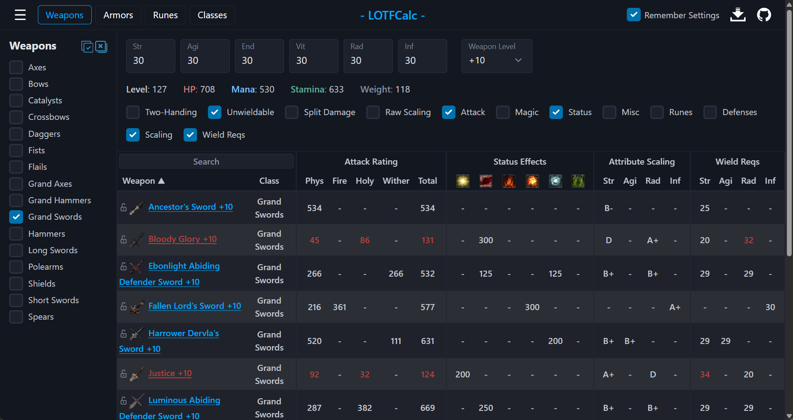

# LOTFCalc

LOTFCalc lets you compare and analyse the gear from Lords of the Fallen (2023 version) for any combination of player attributes. It covers four areas of the game: **weapons** (attack ratings, scaling, status, and more for any upgrade level), **armor** (defenses, resistances, and a paper-doll loadout builder), **rune effects**, and **starting classes**. All game data is current as of game version 2.5.

You can use it at [https://slushie7.github.io/LOTFCalc/](https://slushie7.github.io/LOTFCalc/)



## Usage

Switch between the four modes — **Weapons**, **Armors**, **Runes**, and **Classes** — using the buttons at the top of the page. Enter your character's attributes once and they carry across every mode.

A few things work the same everywhere:
- **Filtering** — use the side pane to filter by item/class type.
- **Sorting** — click any column header to sort by it; click it again to reverse the order.
- **Searching** — use the search box in the top-left of the table to filter the current table by name.
- **Pinning** — click the lock icon on any row to keep that item visible even when your current filters would otherwise hide it.
- **Exporting** — use the download icon in the top right corner to export the current table to a CSV file.
- **Remembering settings** — LOTFCalc automatically reloads your most recently used settings the next time you visit the page. To disable this, simply uncheck the "Remember Settings" checkbox in the top-right corner.

You can use the toggles above the table to show and hide different types of information. Because enabling everything at once creates an unwieldy table, some toggles are off by default.

### Weapons

Select the weapon classes you would like to see, enter your attributes, and set the desired upgrade level (+0 to +10). The calculator will show the calculated stats for every weapon in those classes. Depending on your class selection, LOTFCalc will automatically show and hide some columns to make it easier to see what's relevant — for example, if you select only melee weapons the 'Magic' column group is hidden, and if you add 'Catalysts' to your selection the 'Magic' column group is shown.

**Display options:**
- **Two-Handing** — Show each weapon's effective stats as if it were being two-handed.
- **Unwieldable** — If checked, weapons you lack the attributes to wield are still shown (at the game's reduced effectiveness). Uncheck to hide them.
- **Split Damage** — In the game, attack ratings are shown as the weapon's base damage plus the contribution from your stats. Check this to mimic that style.
- **Raw Scaling** — Show scaling grades as raw numerical values instead of letter grades.

**Column groups:**
- **Attack** — Each weapon's attack rating in each of the game's four damage types.
- **Magic** — Spell power and number of spell slots. Only applies to catalysts.
- **Status** — The amount of each status effect a weapon builds up.
- **Misc** — Additional stats used by the game: weight, poise damage, stagger damage, stamina damage multiplier, and PvP multiplier.
- **Runes** — The rune sockets available on each weapon at its current upgrade level. S=Strength, A=Agility, R=Radiance, I=Inferno, *=Meta (any rune).
- **Defenses** — Each weapon's defense values and stability rating.
- **Scaling** — Each weapon's scaling grade in each of the four damage attributes.
- **Wield Reqs** — The attribute requirements to wield each weapon effectively.

### Armors

Choose the armor slots and weight classes you want to see in the side pane, then enter your attributes. Click **Equip** on any piece to slot it into the paper doll; LOTFCalc tallies your equipped pieces and shows the combined defenses, poise, total weight, resulting weight class, and the damage mitigation those values translate to for your character (including defensive stats derived from your character's stats).

### Runes

Filter the runes by socket type (Strength, Agility, Radiance, or Inferno) in the side pane. The effect each rune has when socketed into a weapon or shield is shown.

### Classes

Filter the starting classes by type (Basic or Unlockable) in the side pane. Enter the attributes you're aiming for and press the **Optimal Class** button: LOTFCalc reveals the compatibility columns and sorts the classes by how many additional levels each one needs to reach your target stats, so you can see which class gives your build the most efficient start.

**Column groups:**
- **Starting Stats** — Each class's starting attributes.
- **Optimization** — How many levels each class needs to reach your entered stats, and the resulting final level (revealed by the Optimal Class button).
- **Starting Gear** — Each class's starting weapons and armor.

## Running Locally

LOTFCalc is easy to get running locally using Python as a server. Simply clone the repository, use a terminal to navigate to the directory's root (where index.html is located), and run:
```
python -m http.server
```
You can then use a web browser to navigate to the localhost address provided by Python and use LOTFCalc.

## Updating Game Data

All of the calculator's data resides in a single file, **data.json**, located in the **data** folder.

LOTFCalc's data is current as of game version 2.5. As this was supposedly the final major update, it is unlikely that the data will need to be updated. Regardless, the Python script used to prepare the data for LOTFCalc has been provided in the **LOTFCalcExtractor** directory.

### LOTFCalcExtractor

Before using the Python script, you must export all of the required JSON files from LOTF's game files by using FModel. How to do the extraction is beyond the scope of this readme. I highly recommend following the **excellent** [guide made by Trevoorhees on Nexus Mods](https://www.nexusmods.com/lordsofthefallen2023/mods/90?tab=description).

The following folder must be exported using FModel's "Save Properties (.json)" feature:
- LOTF2/Content/Blueprints

Once everything has been exported, you can run the LOTFCalcExtractor script by opening a terminal in its folder and running it (*change the path to point to FModel's exported 'LOTF2' folder*):
```
python -m LOTFCalcExtractor "C:\Dev\FModel\Output\Exports\LOTF2"
```

## Special Thanks

I would like to give a special thanks to [ThomasJClark](https://github.com/ThomasJClark) for creating his [Elden Ring Weapon Calculator](https://github.com/ThomasJClark/elden-ring-weapon-calculator). LOTFCalc's UI was largely inspired by this calculator's beautiful design.

A special thank you to 4sval for creating [FModel](https://github.com/4sval/FModel), without which this project would not have been possible.

A big thank you to Reddit user MathieuAF for giving me more ideas on how to improve LOTFCalc.

And lastly, the biggest of thank yous to Hexworks and CI Games for creating Lords of the Fallen, a masterpiece of a game.
